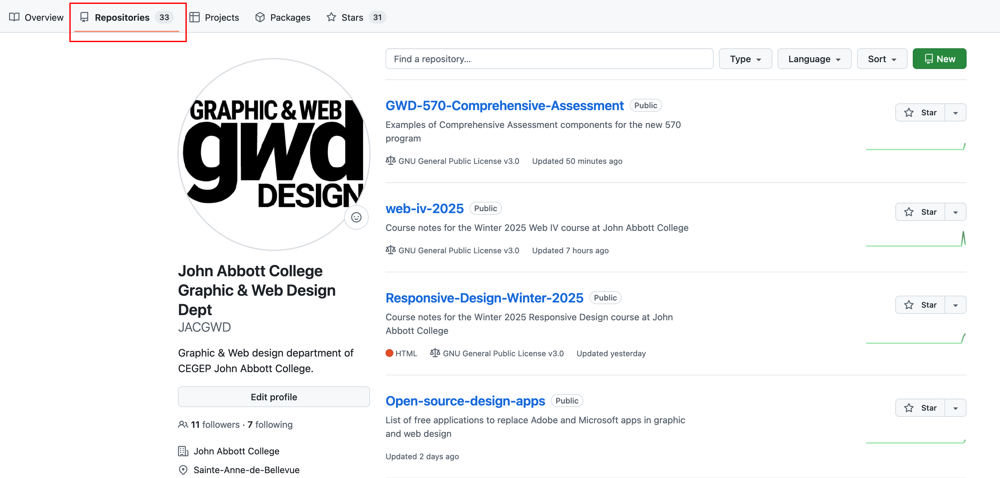
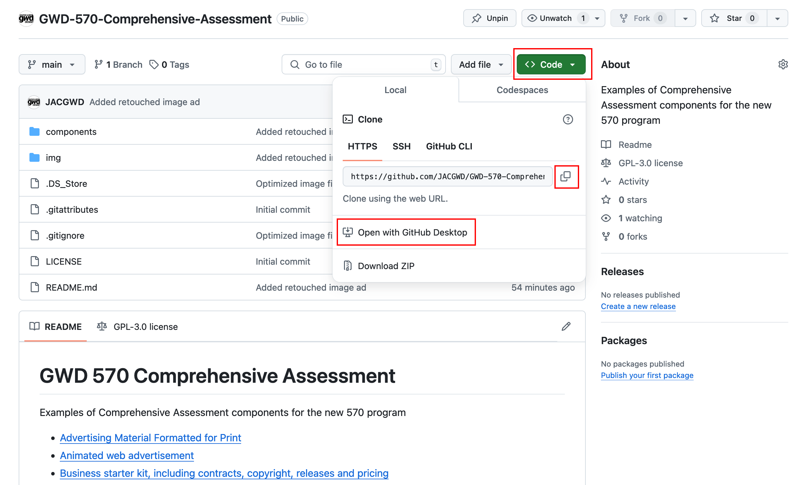
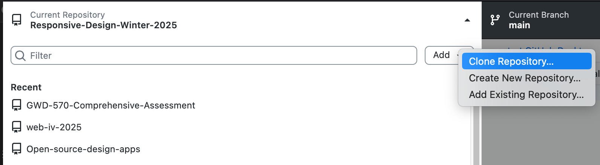
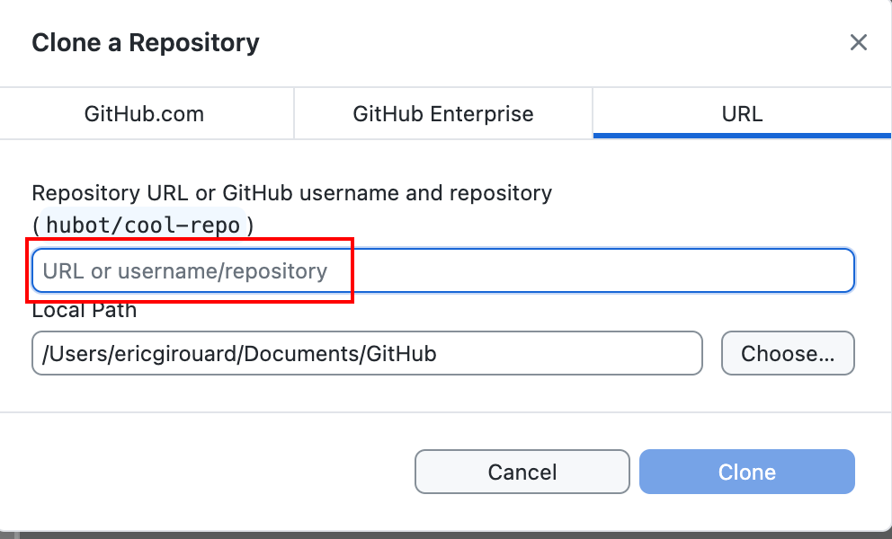
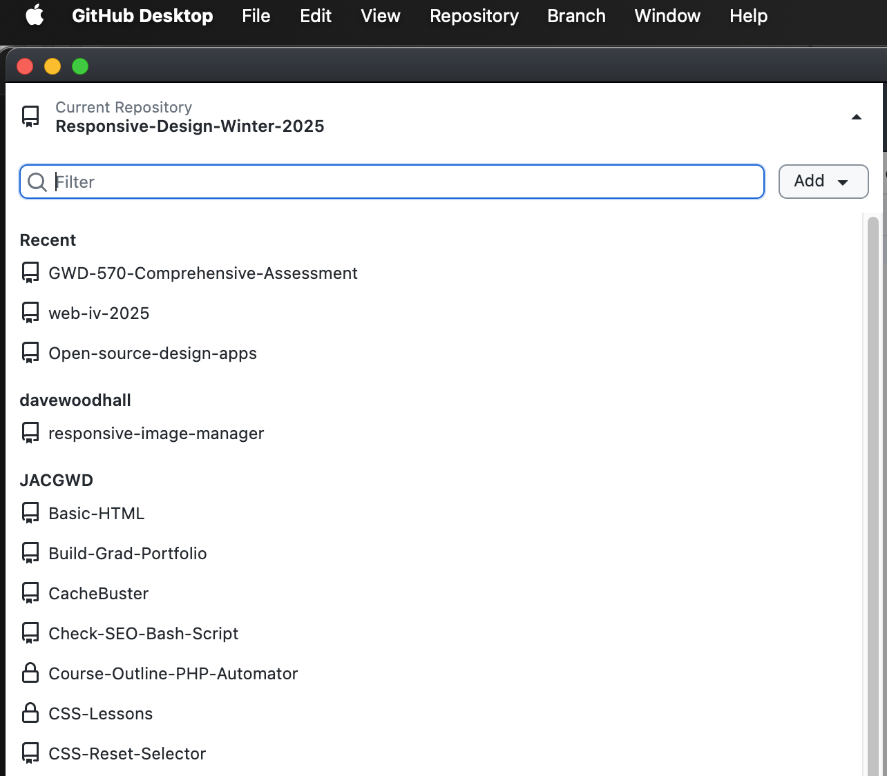
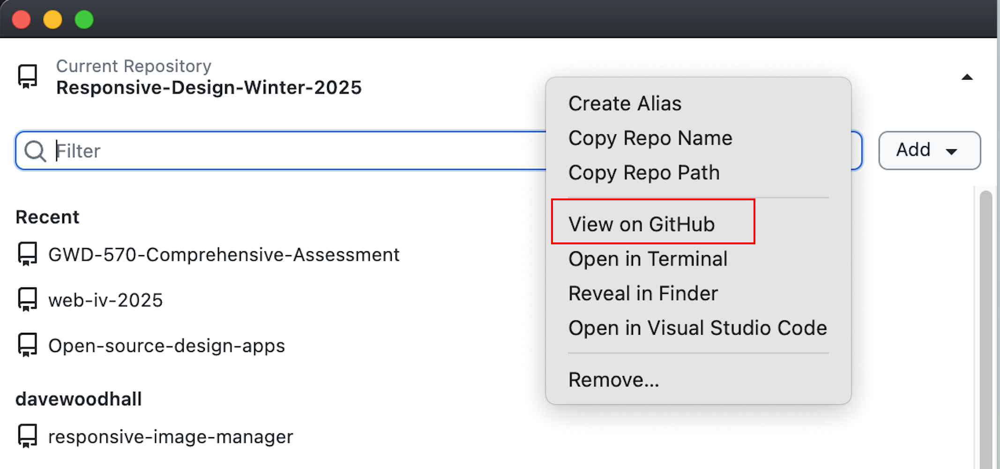
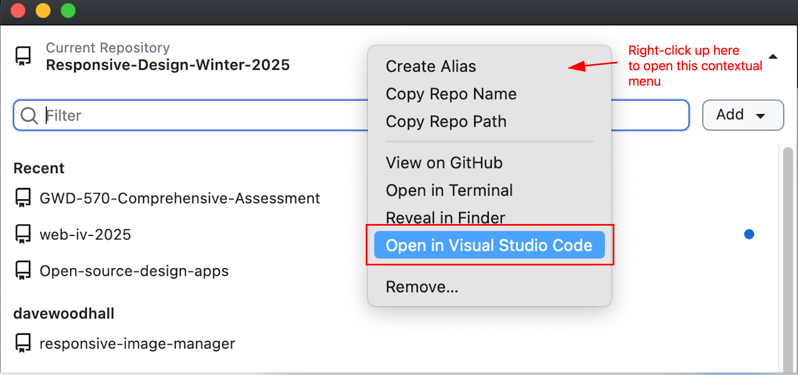
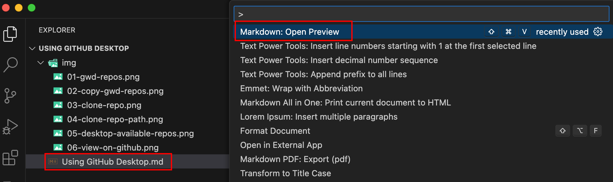
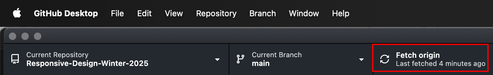
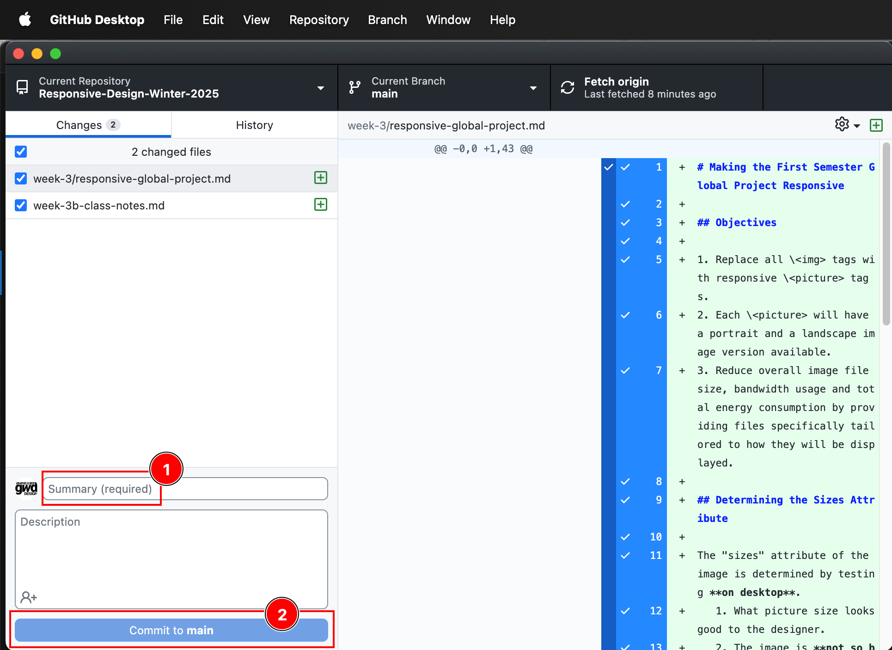

# Using GitHub Desktop
 Instructions for beginner GitHub Desktop users

## GitHub Desktop Explained

**GitHub Desktop** is an application used to:

 - Sync files between members on a team where people can be in different physical locations.
 - Make sure all team members have the latest version of any file in the project.
 - Propose changes to someone else's code.
 - Manage the entire coding project, including:
    - stable features (old, known-good code)
    - work-in-progress (not-yet-good code)
    - all proposed new features (new code)
 - Serve as the in-between between VS Code and the Git repository server.

**GitHub Desktop** is not used to:

- Write code.
- Read code.

## In Class Workflow

In normal class situations, the following tasks are the most frequent:

### 1. Clone a Repo

"Adding a Repo" means that you are choosing a folder of code to sync to your own machine. For example, the GWD GitHub has many folders of code (most of theme written in Markdown) that display as web sites.

#### Go to GitHub and find a repo of interest

#### Find the green Code button and copy the git url

#### In GitHub Desktop, click Add... Clone Repository

#### Paste the git url anc click Clone
 

### 2. Select a Repo

#### In GitHub Desktop, **clicking the top left corner** lets you see the list of repositories on your system

### 3. View the Repo

#### 3a. To see the code presented as a web page (for easy reading), right-click the top left part of GitHub Desktop's main window and select "View on GitHub".

#### 3b. To see the Markdown file saved on your local computer but previewed as a web page: In VS Code, hit command-shift-P to open the Command Palette, start typing "preview", and select Markdown: Open Preview.

All the web page-like pages on GitHub are written in Markdown. All you need to do is open the file in VS Code and preview it as HTML.

### 4. Pull Any Changes

If the master repository (online) has any changes, you need to sync your local copy by "pulling" changes from the server.

### 5. Push Any Changes

If you are making changes to a repository that you own, you can make changes and "push" them to the server by making a "commit".

### 6. Propose Changes to Someone Else's Repo

The heart of open source software development is many people contributing to a project. If you want to make a change to someone else's code, you can. It is a two step process:

1. ["Fork" the repo.](https://docs.github.com/en/pull-requests/collaborating-with-pull-requests/working-with-forks/fork-a-repo?tool=desktop) This creates a different branch where you can make changes.
2. Submit a "pull request" to have your changes merged into the main branch.

